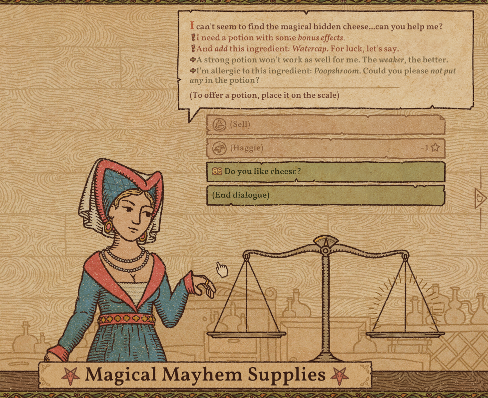

## How to create your customers



Below is an example of how the customer above looks in code form, to be abkle to add them into the game.

```json
    [
        {
            "NpcToCopy": "TrailerRich_F",
            "NpcName": "UniqueCustomers_testing_NPC",
            "QuestName" : "UniqueCustomers_testing",
            "QuestText" : "I can't seem to find the magical hidden cheese...can you help me?",
            "QuestDesiredEffects" : ["MagicalVision"],
            "DayToAppear" : 20,
            "CustMandatory" : {
                "AdditionalEffects" : null,
                "NeedOneParticularIngredient" : "Watercap"
            },
            "CustOptional" : {
                "OnlyWeakPotions" : null,
                "NoParticularIngredient" : "Poopshroom"
            },
            "HasCustomText" : true,
            "DiscussionOptionText" : "<sprite=\"CommonAtlas\"' name=\"MapCollected XP Icon\"> Do you like cheese?",
            "SecondText" : "Yes it's very <i>gouda</i>!"
        }
    ]
```

Let's break it down shall we!

```json
"NpcToCopy": "TrailerRich_F"
```

**NpcToCopy** - This is the template of the NPC you want to copy your appearance from. There is a list of [valid templates](https://github.com/MattDeDuck/UniqueCustomers/blob/master/lists/validtemplates.txt) that you can choose from.

```json
"NpcName": "UniqueCustomers_testing_NPC"
```

**NpcName** - This is the name of your unique customer in which the name needs to be unique (so not the same as other customers)

```json
"QuestName" : "UniqueCustomers_testing"
```

**QuestName** - This is the name of the quest your customer will have. Try to make the name unique so it isn't the same as other quests or customers.

```json
"QuestText" : "I can't seem to find the magical hidden cheese...can you help me?"
```

**QuestText** - This is the text in which will appear in the dialogue box when the customer enters your shop.

```json
"QuestDesiredEffects" : ["MagicalVision"]
```

**QuestDesiredEffects** - This is a list of the potion effects that your customer can accept as valid effects when giving their potion. You can have as many effects as you want. You can see a list of the potion effect names [here](https://github.com/MattDeDuck/UniqueCustomers/blob/master/lists/potioneffects.txt) 
NOTE: If you are wanting to have multiple effects accepted then add commas for seperation like so `["MagicalVision", "Light"]`

```json
"DayToAppear" : 20
```

**DayToAppear** - This is the day you want your customer to appear. They will apear at the end of the queue for that day.

## QUEST REQUIREMENTS

These are the bits of text that appear below the main text of your customer request. There are **two** different types of additional requirements you can have...MANDATORY and OPTIONAL.

A MANDATORY requirement means it will appear with a red exclamation point in which the requirement MUST be met to satisfy your customer. There can be up to 2 of these.
AN OPTIONAL requirement means it will appear with a green + sign in which it's entirely optional for you to adhere to. However customers still can be moody with you if you don't complete them. There can also be up to 2 of these.

There can be up to 4 requirements on a given quest (2 mandatory and 2 optional) but only if they are compatible with each other.

You can see all the information regarding requirements [here](https://github.com/MattDeDuck/PotionCraftInfo/wiki/Potion-Craft:-Alchemist-Simulator-%5BRequirement-Info%5D) in which also tells you the names and conditions of each requirement.

```json
"CustMandatory" : {
                "AdditionalEffects" : null,
                "NeedOneParticularIngredient" : "Watercap"
}
```

For the above mandatory example I have used 2 mandatory requirements.
**AdditionalEffects** - Customer will ask for additional potion effects to be in their potion alongside the main desired effect.
**NeedOneParticularIngredient** - Customer will ask for at least 1 of this ingredient to be included within the potion.

```json
"CustOptional" : {
                "OnlyWeakPotions" : null,
                "NoParticularIngredient" : "Poopshroom"
}
```

For the above optional example I have used 2 optional requirements.
**OnlyWeakPotions** - Customer will want the main potion effect to be Tier 1.
**NoParticularIngredient** - The customer will NOT want this particular ingredient in their potion.


### CUSTOM DIALOGUE TEXT

If you are wanting to have your customer appear with a button you can click on to display a little extra dialogue you can use the following setup.

```json
"HasCustomText" : true
```

**HasCustomText** - If you are wanting custom text then set this to `true` . Setting it to `false` will just let the mod know to ignore following two options.

```json
"DiscussionOptionText" : "<sprite=\"CommonAtlas\"' name=\"MapCollected XP Icon\"> Do you like cheese?"
```

**DiscussionOptionText** - This is the text you want to appear on the button that can be clicked to show the extra dialogue. You can use sprites as well.

```json
"SecondText" : "Yes it's very <i>gouda</i>!"
```

**SecondText** - This is the text you want to appear in the dialogue box when the button above is clicked on.